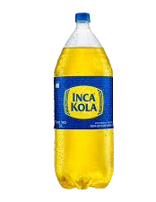

# proyectto-uno
pagina web tipo tottus
<!DOCTYPE html>
<html lang="en">
<head>
    <meta charset="UTF-8">
    <meta name="viewport" content="width=device-width, initial-scale=1.0">
    <title>Document</title>
</head>
<body style="background-color: rgb(246, 249, 153);">

    <h1> Pressur </h1>

    <button> barra de busqueda </button>

 
 <h2 style="height: 120px;"> ventas de productos almenticios </h2> 

 
 <h1> bebidas </h1>

 
 

 <h1> abarrotes </h1>

 
 

<h4> 25% dscto en detergentes </h4>

<button style="flex-direction: column;"> ir al sitio </button>

<h1> pescados </h1>

 
 

<h1> frutas </h1>

 
 

<h1> carnes </h1>

 
 

 <h1> aa </h1>

 

    
</body>

</html>